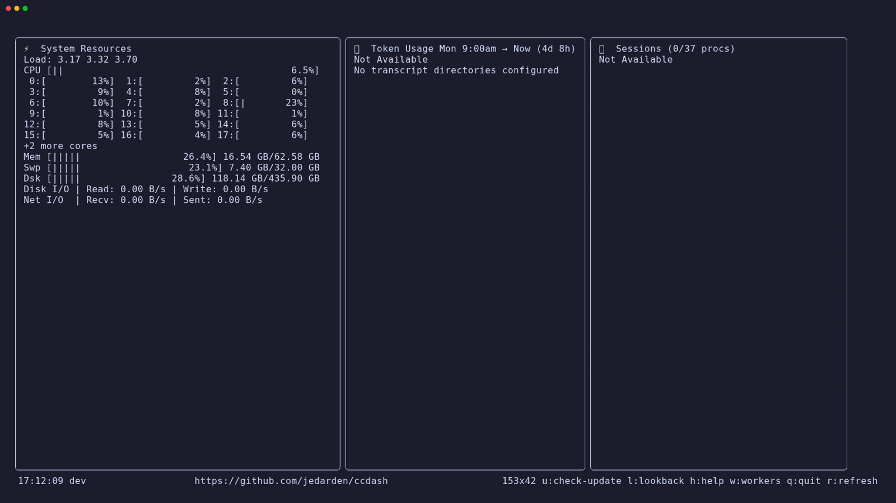

# ccdash

[](docs/notes/bf-2t2-ci-migration.md)

A lightweight terminal dashboard for Claude Code and Codex CLI — shows token usage, cost, agent session status, and system resources in real time.

Built with [Bubble Tea](https://github.com/charmbracelet/bubbletea).



*Recorded with an isolated home directory and no sample session or token data.*

---

## What it shows

**Token panel** — aggregates usage from Claude Code's JSONL logs in `~/.claude/projects`, Codex rollout logs in `~/.codex/sessions/YYYY/MM/DD`, and OpenCode's session store at `~/.local/share/opencode/opencode.db` (read-only; override with `OPENCODE_DB`). OpenCode models appear as `<provider>/<model>`, for example NEEDLE's `opencode/space-bunny-free` workers; free Zen models (`-free`) are priced at zero. Displays input, output, and cache tokens; total cost; tokens/min rate; and a per-model cost breakdown, color-coded and sorted by spend.

**Session panel** — shows active Claude Code and Codex agent sessions and their current state. Hook-tracked sessions carry a Claude 🤖 or Codex 💻 badge:

| Status | Indicator | Meaning |
|--------|-----------|---------|
| ASKING | 🟣 | Waiting for a human response |
| WORKING | 🟢 | Claude Code is actively processing |
| READY | ⚪ | Idle and waiting for the next prompt |
| ACTIVE | 🟡 | Recent user activity detected |
| ERROR | ❌ | Error or undefined session state |

Session tracking has two modes: tmux pane inspection (automatic) and hook-based tracking (more accurate). Install Claude hooks with `ccdash --install-hooks` or Codex hooks with `ccdash --install-codex-hooks`.

**System panel** — CPU, memory, swap, disk, network I/O, and load average via [gopsutil](https://github.com/shirou/gopsutil).

---

## Installation

### Pre-built binary

Download the latest release from the [releases page](https://github.com/jedarden/ccdash/releases), make it executable, and move it to your PATH.

### Using Go

Requires Go 1.24.0 or newer, as specified in `go.mod`.

```bash
go install github.com/jedarden/ccdash/cmd/ccdash@latest
```

### From source

```bash
git clone https://github.com/jedarden/ccdash.git
cd ccdash
make install
```

---

## Usage

```bash
ccdash
```

## Command-line flags

| Flag | Description |
|------|-------------|
| `--help` | Show usage and keyboard shortcuts. |
| `--version` | Print the build version. |
| `--install-hooks` | Install Claude Code hooks for session status tracking. |
| `--install-codex-hooks` | Install Codex hooks for session status tracking. |
| `--check-hooks` | Check whether Claude Code or Codex hooks are installed. |
| `--uninstall-hooks` | Remove ccdash hooks from Claude Code and Codex. |
| `--once` | Collect one metrics snapshot and exit without opening the dashboard. |
| `--json` | Print the snapshot as JSON; use with `--once`. See the schema notes below. |
| `--since=<window>` | Set the token lookback for `--once` or `--export`: `monday`, `today`, `24h`, `7d`, or an RFC3339 timestamp. |
| `--attention` | List ASKING sessions and exit with status 1 if any need a human. Runs a session-only check by itself; also works with `--once`. |
| `--export=<format>` | Write cached token data to standard output. Formats: `csv`, `json`, or `json-aggregated` (legacy summary). |
| `--test-notify` | Send a test payload to the configured notification webhook and report whether it succeeded. |
| `--extra-dirs=<paths>` | Also scan comma-separated Claude project roots. Paths may include glob patterns. `CCDASH_EXTRA_DIRS` provides the same setting with colon-separated paths. |

For example, collect one snapshot as JSON or export the raw cache data:

```bash
ccdash --once --json
ccdash --once --json --since=7d
ccdash --export=csv
ccdash --export=json --since=2026-10-01T09:00:00-04:00
ccdash --attention
```

`--since=monday` uses the same Monday at 9:00 AM local-time boundary as the
dashboard's default token window. `today` starts at local midnight; `24h` and
`7d` count back from the current time. RFC3339 values include an explicit time
zone. Every export format uses the selected boundary; `json-aggregated` keeps
its existing 90-day default when `--since` is omitted. CSV and JSON exports
filter individual events and keep cached file aggregates whose latest event is
in the window, matching the dashboard's aggregate lookback behavior.

`--attention` checks session status without collecting system or token metrics.
It prints the names of sessions in `ASKING` and exits 1 when there are any;
otherwise it reports that no sessions need a human and exits 0. With `--once`,
the snapshot is still emitted and the command exits 1 if any session is asking.

### One-shot JSON output

Use `--once --json` to collect one snapshot without starting the dashboard:

```bash
ccdash --once --json
```

The output has a top-level `schema_version` integer. Version `1` uses
`snake_case` field names throughout `system`, `tokens`, and `sessions`. Consumers
should check this value before relying on the documented shape; an incompatible
schema change increments it. Optional `error` fields appear only when a
collector reports an error.

Rates that require two samples are `null` in a one-shot result: `system.disk_io`
and `system.net_io` byte-per-second fields, each interface's byte-per-second
fields, and `tokens.rate`. A `null` value means no current rate sample is
available; it is distinct from a measured rate of zero. `tokens.session_avg_rate`
is an aggregate over the token session and remains numeric. `tokens.time_span`
is encoded as a duration in nanoseconds.

Each `tokens.model_usages` entry has `pricing_estimated`: `true` when the cost
was not computed from a known price for that exact model (a family fallback,
or an unknown model counted at `$0`). The dashboard marks these models with
`?`. Set exact prices in `~/.ccdash/config.yaml` to clear the flag.

### Keyboard controls

| Key | Action |
|-----|--------|
| `q` / `Ctrl+C` | Quit |
| `r` | Force refresh |
| `h` | Cycle help panels (explains each section) |
| `l` | Open lookback picker (change the token measurement window) |
| `w` | Open worker details (full session names, workspace paths, status, executor, and bead progress) |
| `u` | Self-update to latest release (when available) |

In worker details, use `↑` / `↓` or `j` / `k` to browse workers. Press `w`,
`q`, or `Esc` to return to the dashboard; `Ctrl+C` still quits.

### Lookback window

Press `l` to change how far back the token panel looks:

- Monday 9am (default — useful for weekly work tracking)
- Today
- Last 24h / 7d / 30d / All time
- Custom date and time (navigate with arrow keys)

### Layout

ccdash automatically adjusts to your terminal width:

- **Narrow** (< 120 cols): panels stacked vertically
- **Wide** (120–239 cols): two panels on top, one below
- **Ultra-wide** (≥ 240 cols): three panels side by side

---

## Hook-based session tracking

For accurate Claude per-session status (especially the WORKING/ASKING distinction), install Claude Code hooks:

```bash
ccdash --install-hooks
```

This writes hook scripts that fire on Claude Code lifecycle events, writing session state to `~/.ccdash/sessions/`. The dashboard reads those files alongside the tmux pane inspection — hook data takes precedence when available.

For Codex CLI, install its equivalent status-only hooks with:

```bash
ccdash --install-codex-hooks
```

This adds `SessionStart`, `SessionEnd`, `UserPromptSubmit`, `PreToolUse`, `PostToolUse`, `PermissionRequest`, and `Stop` entries to `~/.codex/hooks.json`. Token counts are read from rollout JSONL, not hook payloads. Use `ccdash --check-hooks` to inspect either harness and `ccdash --uninstall-hooks` to remove ccdash entries from both.

Check whether hooks are installed:

```bash
ccdash --check-hooks
```

---

## Multi-project token tracking

By default, ccdash scans `~/.claude/projects` for all JSONL usage files. To include additional project root directories:

```bash
# Via flag (comma-separated)
ccdash --extra-dirs /path/to/projects,/other/path

# Via environment variable (colon-separated)
CCDASH_EXTRA_DIRS=/path/to/projects:/other/path ccdash
```

---

## Token cache

Token data is persisted to `~/.ccdash/tokens.db` (SQLite). You can query it directly with `sqlite3` or DuckDB:

```bash
sqlite3 ~/.ccdash/tokens.db "SELECT model, SUM(COALESCE(input_tokens, 0) + COALESCE(output_tokens, 0) + COALESCE(cache_read_tokens, 0) + COALESCE(cache_creation_tokens, 0)) AS total_tokens FROM token_events GROUP BY model ORDER BY total_tokens DESC;"
```

The cache stores token categories, not `total_tokens` or `cost` columns. ccdash
calculates totals and estimated costs from those counts and the model pricing
data.

---

## Configuration and notifications

Create `~/.ccdash/config.yaml` to enable webhook notifications or set a cost
threshold. Notifications are off by default; replace the example URL with your
own HTTP(S) webhook before enabling them.

```yaml
notify:
  enabled: false
  webhook_url: "https://your-webhook.example/ccdash"
alerts:
  cost_threshold_usd: 25.00
```

`notify.enabled` defaults to `false`. When enabled, ccdash sends a webhook when
a hook-tracked session enters a waiting/asking state and remains there for 15
seconds. Only the lease-holding dashboard instance sends it, once per waiting
episode. Delivery failures do not stop the dashboard.

The JSON POST body contains only the session name, project directory, and idle
duration in nanoseconds:

```json
{
  "session_name": "example-session",
  "project_dir": "/path/to/project",
  "idle_duration": 30000000000
}
```

It does not include transcripts, prompts, token counts, or cost data. Running
`ccdash --test-notify` sends a synthetic payload to the configured URL
immediately; the command requires `notify.enabled: true` and a webhook URL.
The `alerts.cost_threshold_usd` setting is independent of webhooks: a positive
value highlights the dashboard's cost when the current lookback total reaches
that USD amount. Zero or omission disables the highlight.

### Model prices

ccdash ships a price table for Claude, Codex (OpenAI), GLM, and OpenCode
models. A model missing from it is priced from its family, or at `$0` when no
family matches, and is marked `?` in the dashboard and
`"pricing_estimated": true` in `--once --json`. Add exact per-million-token
prices under `pricing.models`, keyed by the model id as it appears in the
dashboard's JSON output; a configured price takes precedence over the table and
is never marked estimated:

```yaml
pricing:
  models:
    gpt-6-sol:
      input_per_million: 5.00
      output_per_million: 30.00
      cache_read_per_million: 0.50
      cache_create_per_million: 6.25
```

The values above are placeholders; use your provider's published rates.

## Development

Requires Go 1.24.0 or newer. From a clone, build and install with:

```bash
make build       # Build ./bin/ccdash
make install     # Install ccdash into the Go bin directory
```

Run the checks and formatting tools with:

```bash
make test        # Run the Go test suite
make fmt         # Format Go source
make vet         # Run go vet ./...
go mod download  # Download dependencies
```

The entry point and CLI are in `cmd/ccdash`; `internal/metrics` collects
system, token, tmux, and hook data; `internal/notify` sends optional webhooks;
and `internal/ui` implements the Bubble Tea dashboard. `make clean` removes
local build artifacts.

---

## Requirements

- Go 1.24.0 or newer for installation from source.
- Claude Code and/or Codex CLI data for token usage and hook tracking.
- tmux (optional, for pane-based session tracking).

---

## License

MIT — see [LICENSE](LICENSE).

---

Part of [jedarden.com](https://jedarden.com) · Read the write-up: [jedarden.com/projects/ccdash/](https://jedarden.com/projects/ccdash/)

*This GitHub repo is a read-only mirror of git.ardenone.com/jedarden/ccdash — issues and PRs are welcome here either way.*
